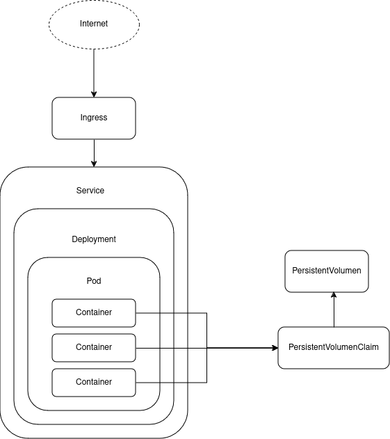

# Demo técnica de k8s
## Requisitos

Instalación de Docker
https://docs.docker.com/engine/install/ubuntu/
https://docs.docker.com/engine/install/linux-postinstall/

Instalación de Kubectl
https://kubernetes.io/docs/tasks/tools/install-kubectl-linux/

Instalación Minikube
https://minikube.sigs.k8s.io/docs/start/?arch=%2Flinux%2Fx86-64%2Fstable%2Fbinary+download

Habilitar Ingress de Nginx
https://minikube.sigs.k8s.io/docs/handbook/addons/ingress-dns/#Linux

## Conceptos 

Como es una demostración técnica, más que una explicación, a continuación hay un pequeño índice de conceptos ordenados de más sencillo a más complejo.

Contenedor https://www.docker.com/resources/what-container/
Imágenes https://aws.amazon.com/es/compare/the-difference-between-docker-images-and-containers/
Repositorio de imágenes (quay.io, docker hub, Github packages, etc)
Namespace https://kubernetes.io/es/docs/concepts/overview/working-with-objects/namespaces/
Pod https://kubernetes.io/es/docs/concepts/workloads/pods/pod/
Deployment https://kubernetes.io/docs/concepts/workloads/controllers/deployment/
Service https://kubernetes.io/es/docs/concepts/services-networking/service/
Ingress / Regla Ingress https://kubernetes.io/docs/concepts/services-networking/ingress/





## Comandos de ayuda

Necesario para compilar el proyecto, generar una imagen (sin necesidad de tener Docker instalado) y subir la imagen a un repositorio.
```
./mvnw compile com.google.cloud.tools:jib-maven-plugin:3.2.0:build -Dimage=z0s3r77/springboot-example:latest  -Djib.to.auth.username=z0s3r77 -Djib.to.auth.password=$SECRETPASS
```

Kubectx es una herramienta que al descargala nos da la posibilidad de ver el contexto (cluster) en el que estamos trabajando y
también nos agrega la herramienta kubens, que nos da la posibilidad de ver el namespace en el que estamos.
```
sudo snap install kubectx --classic
```

## Guia

- Verificar que tenemos un cluster de minikube
```
minikube start 
minikube ip
```

- Verificar que tenemos vinculado el cliente kubectl con minikube
```
kubectl get pods
```

- Habilitar el servicio ingress que trae por defecto minikube
```
minikube addons enable ingress
```

- Aplicar en orden el comando _apply_
    - Namespace
    - persistentVolumen
    - persistentVolumenClaim
    - Deployment
    - Service
    - Ingress

```
kubectl apply -f archivo.yaml
```

#### Importante

- Antes de crear un recurso debemos asegurarnos que estamos en el namespace apropiado.
- Antes de crear un deployment, debemos asegurarnos que los recursos que vamos a necesitar están creado (en el caso de la demo son PersistentVolume y PersistentVolumeClaim)
- Es 100% levantar los recursos a partir de manifiestos.

## Versionado de la aplicación de Springboot

v1 : Disponibles endpoints /api/test/sebas, /api/sebas

v2 : Se quita el endpoint /api/test/sebas (deprecated)

v3: Se añade el endpoint /api/test/read-file


